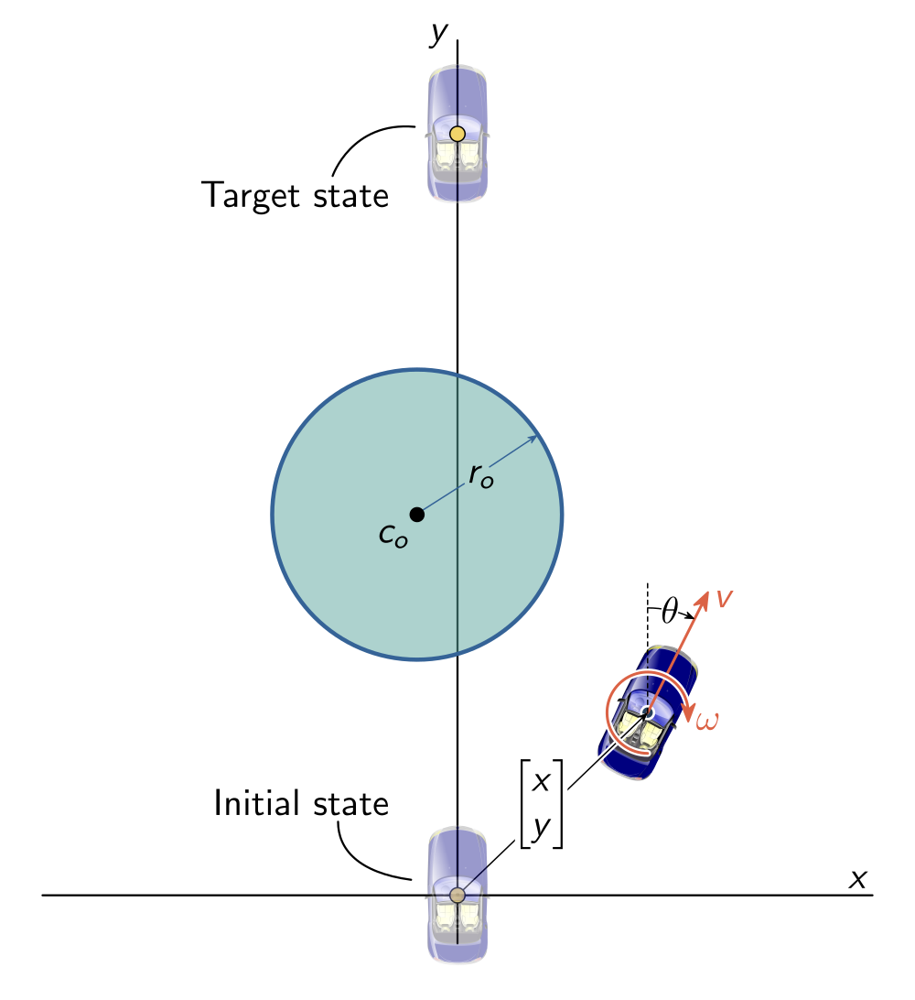
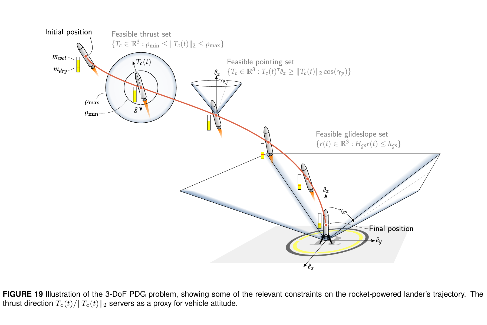

# Dubin's Car Trajectory Optimization 
An Example from *A Tutorial on Generating Dynamically Feasible Trajectories Reliably and Efficiently*

Arxiv：2106.09125v1
Github：https://github.com/UW-ACL/SCPToolbox.jl

***
#### 1.问题描述

给定 $t_f$，求轨迹 $\vec{x}(t) \in \R^3$ 和控制 $\vec{u}(t) \in \R^2$，满足：
1. 动力学约束；
2. 边界约束；
3. 避障约束；
4. 最小化目标函数。

  

核心变量定义：
- 状态向量（位置与方位角）：
\[
\vec{x}(t) = \begin{bmatrix} x(t) \\ y(t) \\ \theta(t) \end{bmatrix} 
\]
- 控制输入（线速度与角速度）：
\[
\vec{u}(t) = \begin{bmatrix} v(t) \\ \omega(t) \end{bmatrix} 
\]

其中，归一化时间 \(t \in [0,1]\)，通过$\vec{p} = t_f $与实际情况关联。

**难点:**
直观上，这里的避障约束是非凸问题，因可行域——圆外区域是非凸集。而在各特定位置 $\vec{x}$ 做泰勒一阶展开（使用雅可比矩阵），就能把避障约束变成线性约束，也即凸约束。
据说由于类似原因，动力学约束也要线性化。

#### 2.动力学方程

\[\dot{x}(t) = f(t, x(t), u(t), p)\]

处理好时间归一化问题后写作：
\[\frac{dx}{dt} = t_f \tilde{f}(t, x, u) \equiv f(t, x, u, p)\]
**雅可比矩阵**
如前文所述，SCP 算法需迭代线性化非凸动力学，需提供以下雅可比矩阵：
- 状态雅可比：    $\vec{A}(t,\vec{x},\vec{u},\vec{p}) = \nabla_{\vec{x}} \vec{f}$

- 输入雅可比：      $\vec{B}(t,\vec{x},\vec{u},\vec{p}) = \nabla_{\vec{u}} \vec{f}
$
- 参数雅可比：  $\vec{F}(t,\vec{x},\vec{u},\vec{p}) = \nabla_{\vec{p}} \vec{f} $

#### 3.约束条件
**边界约束（等式约束，即固定起点和终点）：**
- 初始边界条件： $ g_{\text{ic}}(\vec{x}(0),\vec{p}) = \vec{x}(0) - \vec{x}_0 = \vec{0} $
- 终端边界条件： $g_{\text{tc}}(\vec{x}(1),\vec{p}) = \vec{x}(1) - \vec{x}_f = \vec{0} $

也要提供相应雅可比矩阵，因为*通常这些函数可能是非仿射函数*（?）。

**避障约束（不等式约束）：**
需避开中心为 $\vec{c}_0$、半径为 $r_0$ 的圆形障碍物，考虑车身宽度，引入安全距离 $\Delta r_0$ 膨胀障碍物：
- 避障约束函数（满足 $s(\cdot) \le 0$ 时避障可行）：
\[
s(t,\vec{x},\vec{u},\vec{p}) = (r_0 + \Delta r_0)^2 - \|\vec{E}_{xy}\vec{x} - \vec{c}_0\|_2^2 
\]

约束雅可比矩阵（ $\vec{C}$、$\vec{D}$、$\vec{G}$）：
\[
\vec{C}(t,\vec{x},\vec{u},\vec{p}) = \nabla_{\vec{x}} s … 
\]

#### 4.目标函数
目标为最小化控制输入能量，采用 Bolza 形式（终端成本 + 运行成本）：
\[
J(\vec{x},\vec{u},\vec{p}) = \phi(\vec{x}(1),\vec{p}) + \int_0^1 \Gamma(\vec{x}(t),\vec{u}(t),\vec{p}) dt 
\]

- 终端代价（这里都是严格的约束，所以为 0 ）：      $\phi(\vec{x}(1),\vec{p}) = 0$
- 运行代价（最小化控制能量）： $\Gamma(\vec{x},\vec{u},\vec{p}) = \vec{u}^T \vec{u} = v^2 + \omega^2 $

避免控制输入过大（比如角速度 ω 太大，车辆急转弯；线速度 v 太大，能耗过高），本质是最小化控制能量消耗（用控制输入的平方和表征能量消耗）。

#### 5.求解
连续的轨迹求解会被转化成求离散节点上的 $\vec{u}(t)$。此外，可以采取不同惩罚策略，如 PTR 和 SCvx ，最终效果如下：

***
最后，作者 Danylo Malyuta 似乎任职于 SpaceX，论文*Convex Optimization for Trajectory Generation* 研究的也并非小汽车，而是航天器着陆的轨迹优化问题（太酷了！）：

