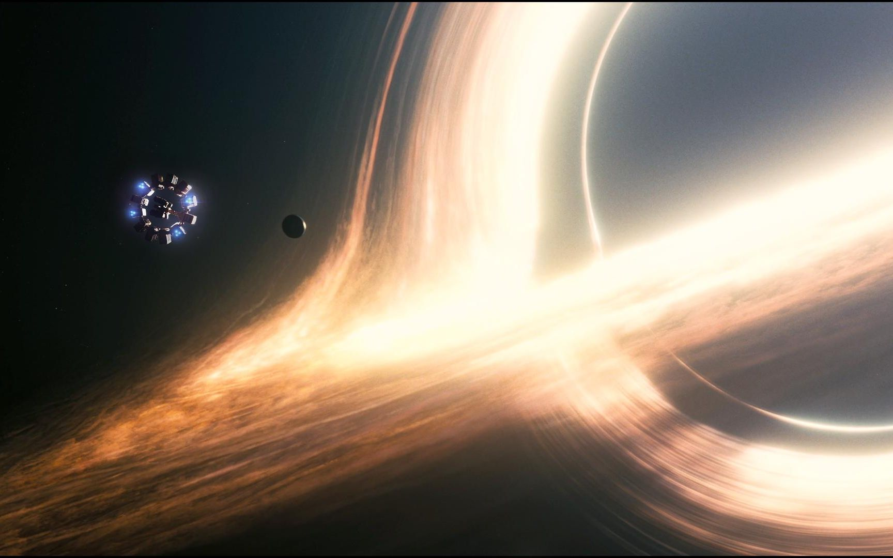
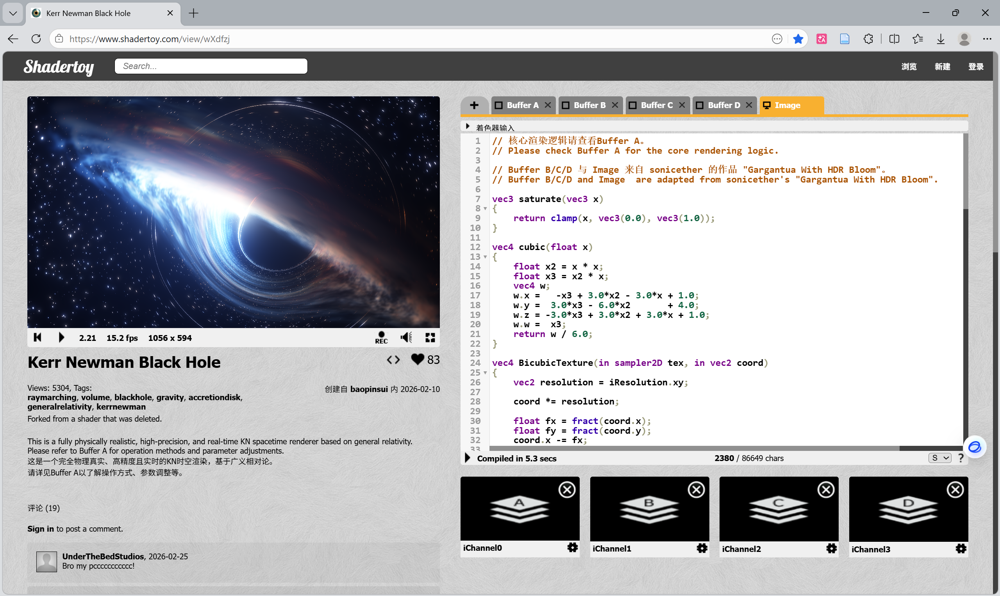

## 一件克尔-纽曼黑洞实时渲染作品

Summary：基于 Shadertoy 平台的 *Kerr Newman Black Hole* 实时渲染作品，粗浅学习和复述其基于广义相对论的物理建模逻辑，并尤其惊叹于底层简洁的物理规律如何自然涌现出黑洞成像的各标志性视觉特征和恢弘壮丽的最终渲染效果。

### 1.光线追踪技术

光线追踪技术的核心原理是模拟光子从观测者（相机）出发，反向追踪其在场景中的传播路径，通过计算光线与物体的交点、反射、折射及能量传递，还原真实的光影效果。
该技术在现代制片业中不可或缺，是特效及动画影片制作的核心渲染手段和真实感的来源；随着GPU技术的成熟，实时光线追踪已成为3A游戏的标配。

> 2014年《星际穿越》中的卡冈图雅黑洞。得益于技术的进步，本作品似乎在一些细节上更胜一筹，且支持实时调参渲染，本地流畅运行。

GPU以其原生支持 “并行计算” 特性著称，就光追而言，指的是每根光线的路径都可以互不干扰地独立计算；至于人工智能领域，据目前浅薄的理解，卷积池化、加激活函数，以至于矩阵求梯度等操作，都是极其适合GPU特性的。

### 2.核心物理框架与数学建模

这是一个 Shadertoy 网站上的开源项目，令人惊叹的是其**完全基于广义相对论解析解构建**，无任何非物理的观测拟合与人为想象。

#### 时空几何的坐标系选择与度规模型

克尔-纽曼（Kerr-Newman, KN）时空是爱因斯坦场方程描述旋转带电黑洞的唯一渐近平直解析解，刻画了由质量 $M$ 、单位质量自旋角动量 $a$ 、电荷 $Q$ 决定的弯曲时空几何。因传统Boyer-Lindquist球坐标系在视界处存在坐标奇点，本渲染器采用**Kerr-Schild（KS）笛卡尔坐标系**，其度规分解为：

$g_{\mu\nu} = \eta_{\mu\nu} + f \cdot l_\mu l_\nu$ 

式中： $\eta_{\mu\nu}=\text{diag}(1,1,1,-1)$ （闵氏平直时空度规，描述无引力的平直时空）； $f$ 为引力标量函数（由 $M$ 、 $a$ 、 $Q$ 决定，表征时空弯曲程度）； $l^\mu$ 为类光零矢量（满足 $l^\mu l_\mu=0$ ，描述光子的传播方向）。该形式将高阶张量运算简化为线性操作，规避了视界奇点。

#### 类光测地线的哈密顿数值实现

光子（静止质量为0）沿**类光测地线**运动，满足约束：

$g_{\mu\nu}\frac{dx^\mu}{d\lambda}\frac{dx^\nu}{d\lambda}=0$ 

式中 $\lambda$ 为仿射参数（描述光子运动的“步数”，无直接物理意义），这是光速不变原理在弯曲时空的推广。采用**哈密顿正则方程**，以光子4位置 $X^\mu$ （ $x,y,z,t$ 时空坐标）与协变4动量 $P_\mu$ 为正则变量，通过四阶龙格-库塔（RK4）方法（又是它…梦回美赛(ノдヽ)）实现自适应步长积分：每步通过动量缩放保证约束，控制积分终止（光子进入视界或陷入束缚态）。

#### 时空因果边界与相对论频移的统一描述

KN时空的**事件视界**由下式定义：

 

$r_\pm = M \pm \sqrt{M^2 - a^2 - Q^2}$

式中 $r_+$ 为外视界（光子无法逃逸的边界）， $r_-$ 为内视界（屏蔽奇环奇点）（所以黑洞是黑的）。光子颜色与亮度由引力红移和多普勒效应共同决定，通过4动量内积统一计算，频移因子：

 

$g = \frac{E_{\text{obs}}}{E_{\text{emit}}} = \frac{-u^\mu_{\text{obs}} P_\mu}{-u^\mu_{\text{emit}} P_\mu}$ 

式中： $u^\mu_{\text{obs}}$ 为观测者4速度， $u^\mu_{\text{emit}}$ 为吸积盘物质4速度， $P_\mu$ 为光子协变4动量； $E_{\text{obs}}$ 、 $E_{\text{emit}}$ 分别为观测者接收的光子能量与辐射源发射的光子能量。

### 3.视效的自然涌现

该作品的所有视效均为广义相对论规律的自然**涌现**。
1. 强引力透镜效应使吸积盘背面的光子沿黑洞极区弯曲轨迹偏折超过 90 度抵达相机，形成环绕阴影上下边缘的优美的次级光带（实则是背面虚像）

2. 黑洞阴影的 D 形轮廓，源于参考系拖拽——顺行光子（沿自旋方向）更易逃逸，阴影边界圆润，逆行光子更易被捕获，边界扁平，不对称程度与自旋参数正相关。

3. 吸积盘的亮度与色温不对称，是多普勒效应和与聚束（beaming）效应的结果：朝向观测者的一侧光子蓝移、聚束，亮度高且偏蓝；远离一侧红移、通量稀释，亮度低且偏红，自旋也会进一步放大这一效应。
 

> （来自ai的赞美性总结）这种第一性原理渲染方案，既实现了视觉高保真，又复现了黑洞时空的物理内涵，彰显了简洁场方程统摄复杂宇宙奇观的强大力量，也是物理驱动渲染区别于纯图形学拟合的核心价值。

